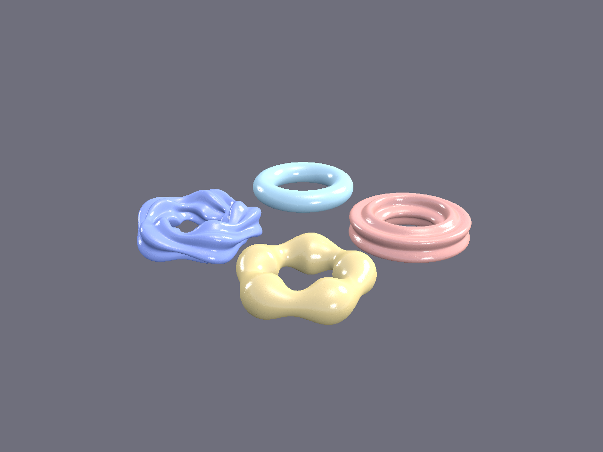
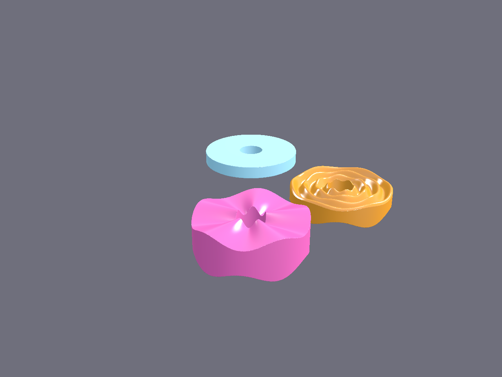
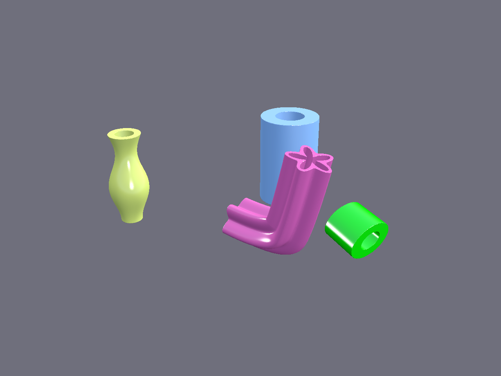
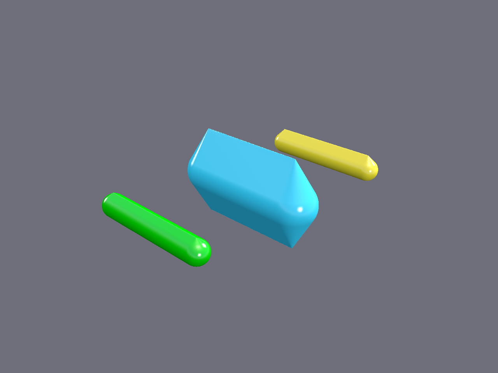
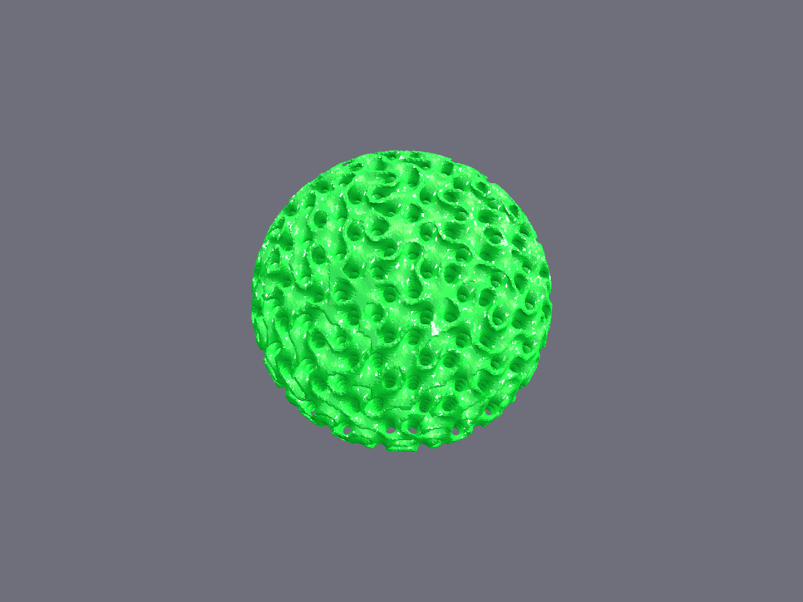
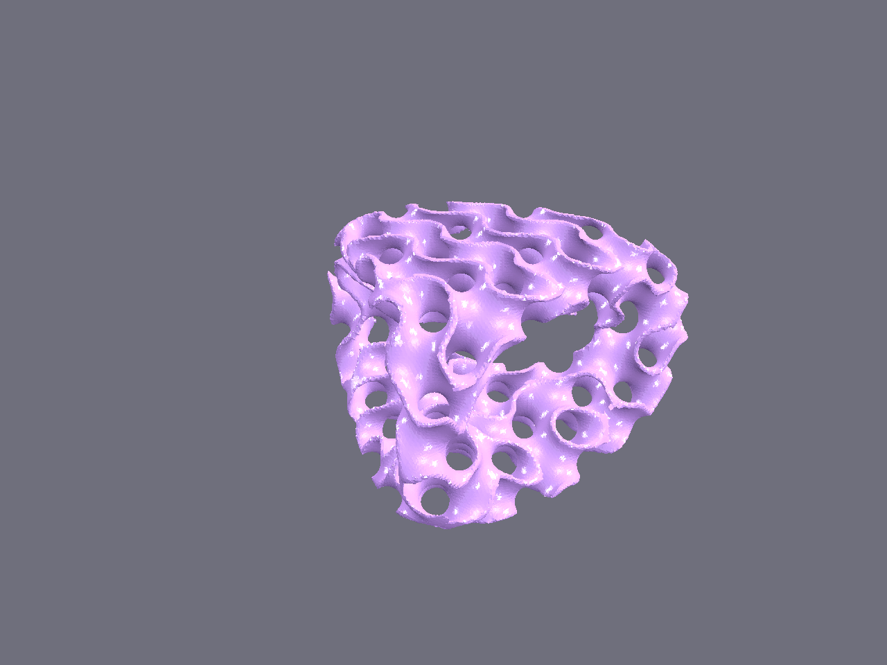
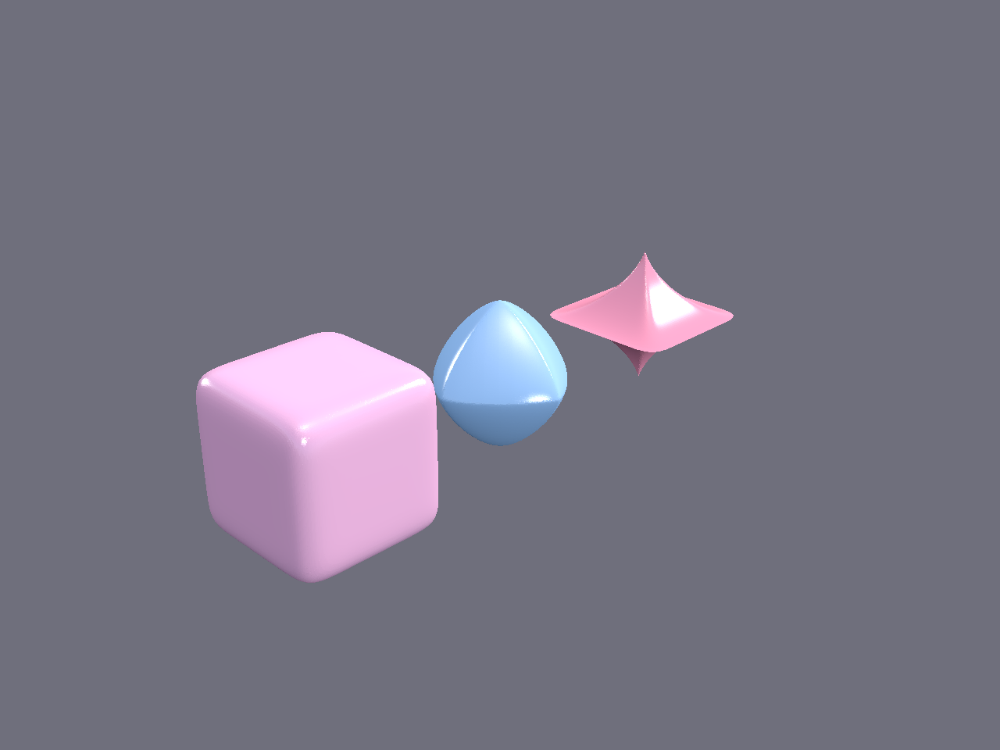

# Gallery

Parametric shape examples built with the Go PicoGK SDK.

The scenes are generated by the [`ffi-gallery` example](../examples/ffi-gallery/),
which uses the FFI SDK (`picogkffi`) and the `picogkshapes` parametric shape
library — a direct port of PicoPie's `picogk.shapes`. Rendering uses the
native OpenGL Viewer (PBR shading), matching PicoPie's output. An
[approximated MCP version](../examples/shapekernel-gallery/) is also
available for comparison.

```bash
cd examples/ffi-gallery
go run main.go                    # render every scene (requires display)
go run main.go -scene sphere      # render one scene
go run main.go -voxel-size 0.1    # finer grid (slower)
go run main.go -no-viewer         # STL output only (headless)
```

## Base shapes






## Pipes & segments




## Lattices & implicits







## Implicits & painter




## Notes

The `ffi-gallery` example uses the `picogkshapes` package — a Go port of
PicoPie's `picogk.shapes` parametric shape library — so the gallery scenes
match the Python output exactly (modulated radii, swept spines, gyroid
infill, etc.). The MCP `shapekernel-gallery` approximates the same scenes
using only the low-level MCP primitives (sphere, box, cylinder, torus,
capsule) plus transforms and booleans.

Surface smoothness is set by the voxel size (`-voxel-size` flag), not the
parametric tessellation: every scene is rasterised to a voxel field and
re-meshed at that grid, so a coarse grid gives faceted silhouettes.