# Gallery

Parametric shape examples built with the MoonBit PicoGK FFI SDK, rendered via
the native OpenGL ViewerEx (with camera callbacks for PBR-shaded 3D rendering).

The scenes are generated by the
[`shapekernel-gallery` example](../examples/shapekernel-gallery/).

```bash
cd examples/shapekernel-gallery
moon run . --target native                # render every scene to PNG
moon run . --target native --no-viewer    # save STLs only (no display needed)
moon run . --target native --scene gyroid_sphere  # render one scene
```

## Base shapes

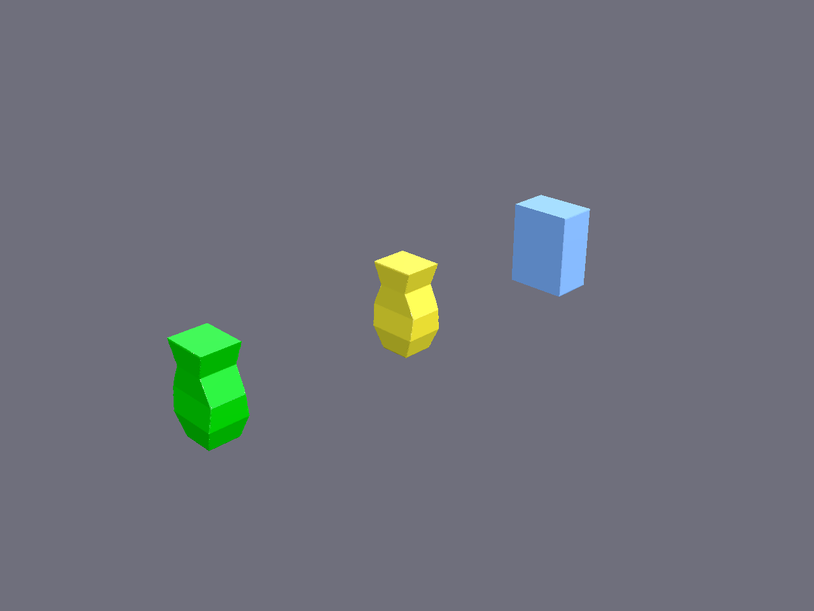

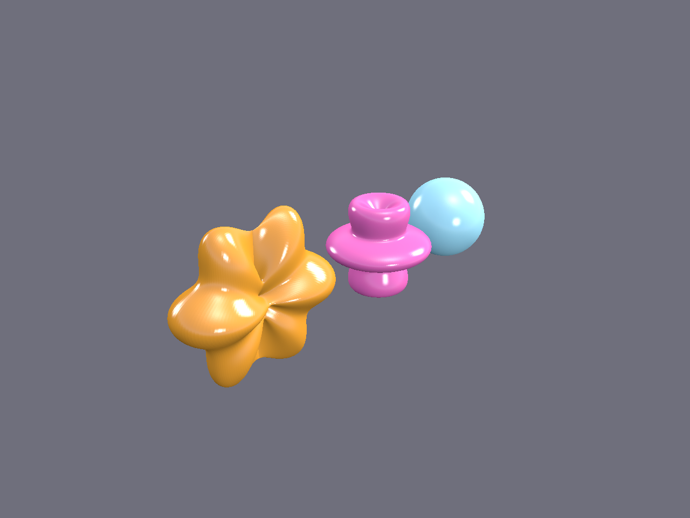


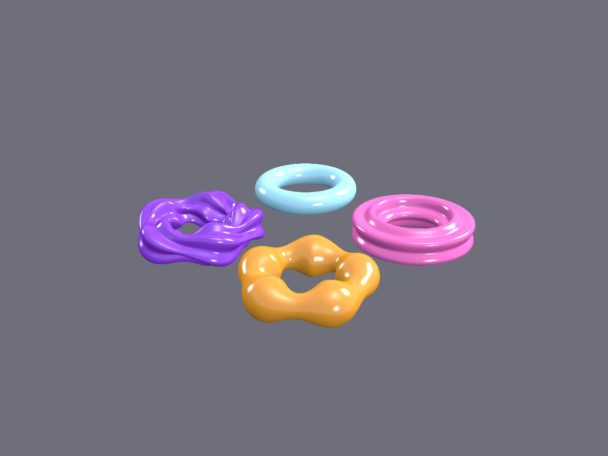


## Pipes & segments

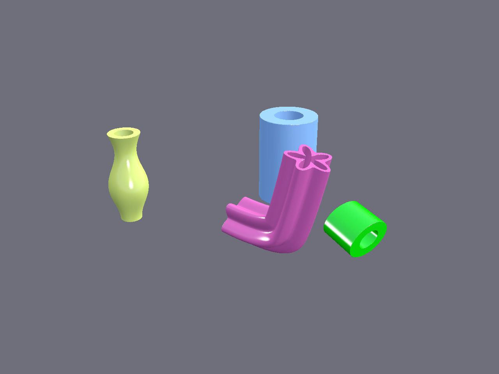

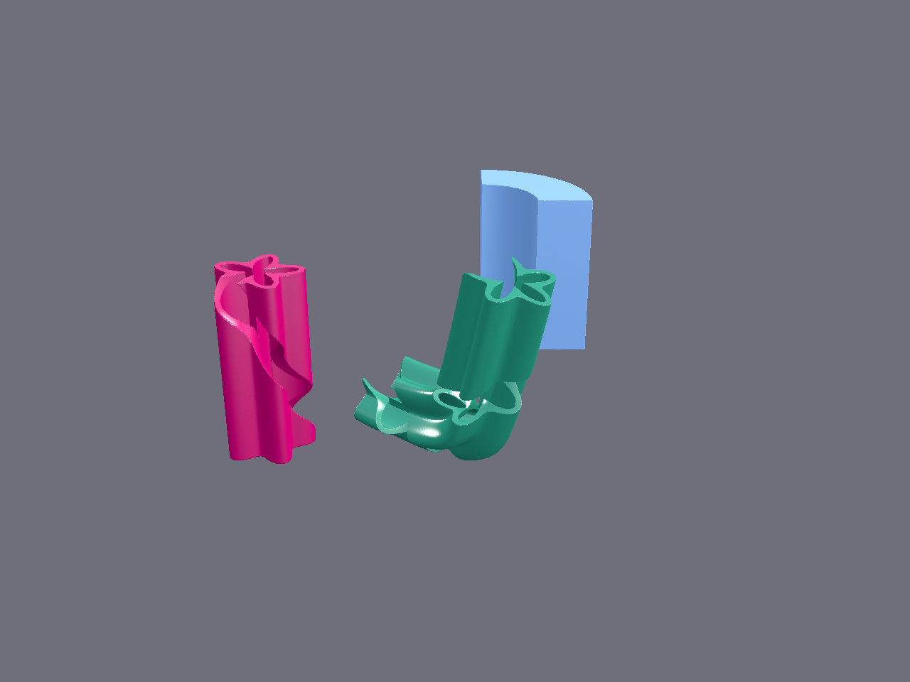

## Lattices & implicits


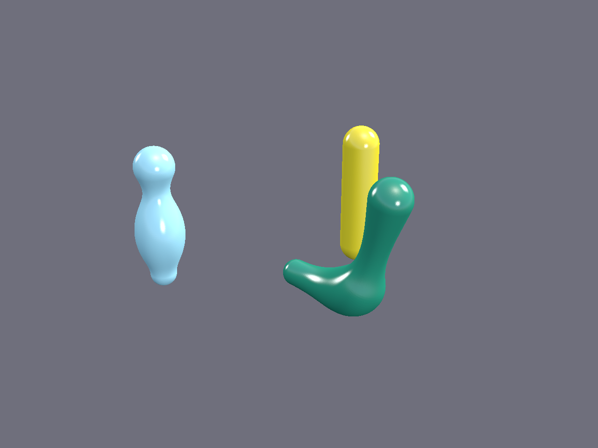

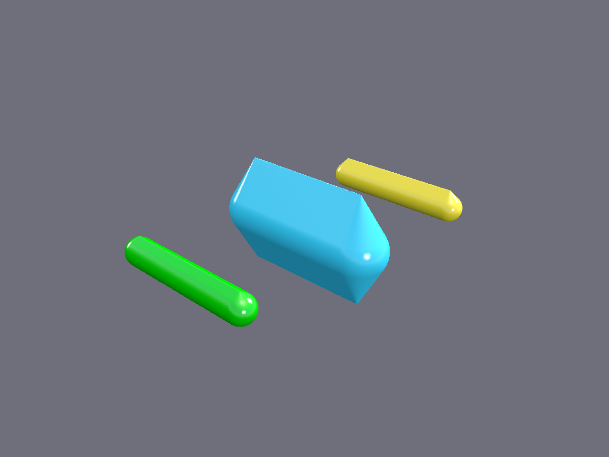

## Implicit SDF scenes

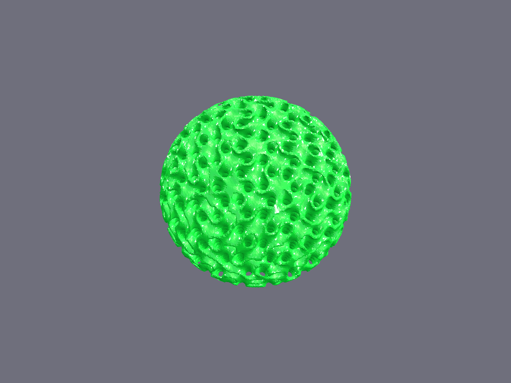

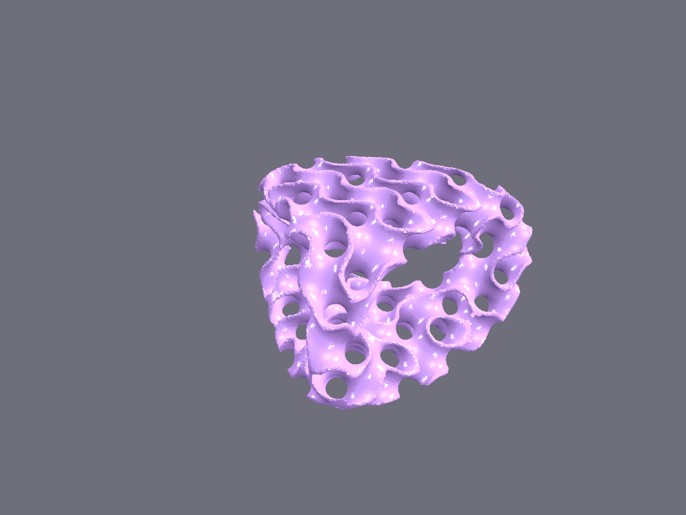

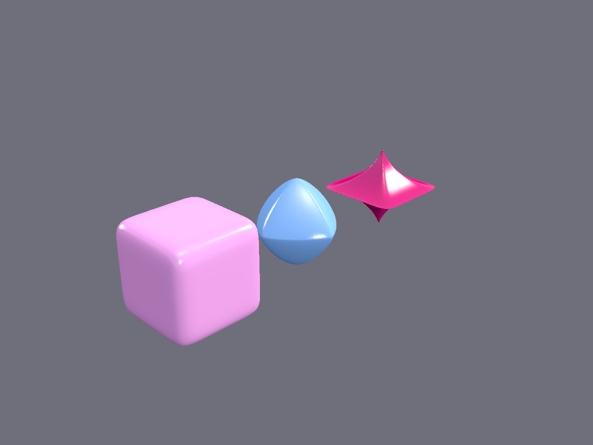

## Mesh operations

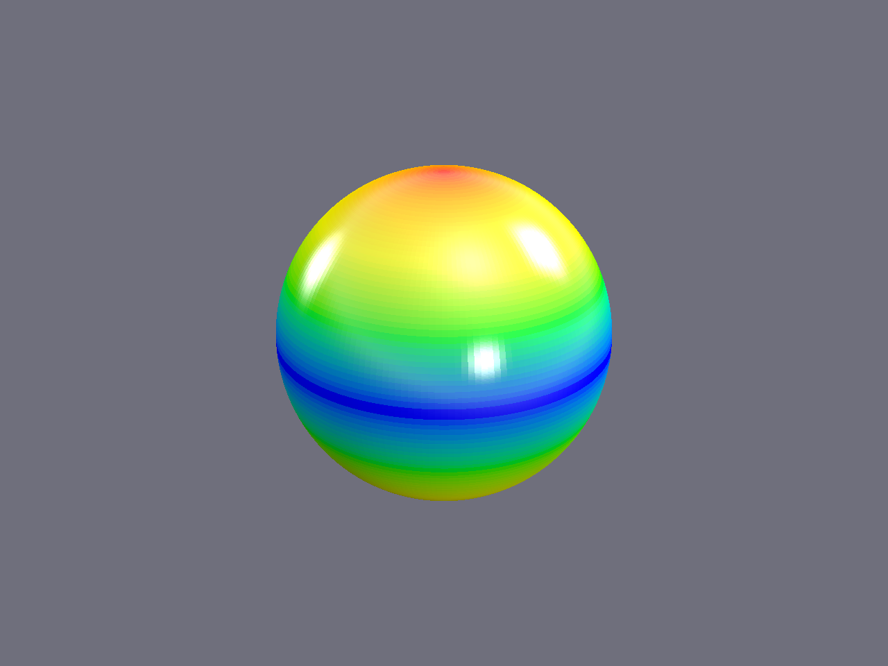


## Notes

The gyroid sphere, gyroid genus, and superellipsoid scenes are rendered via
implicit SDF callbacks (the same approach as the PicoPie Python and Go FFI
versions). The SDF implementations live in C (`picogk_sdf.c`) to avoid
C→MoonBit callback limitations in the native backend.

The remaining scenes use PicoGK primitives (sphere, box, cylinder, capsule,
lattice) with booleans and transforms. The MoonBit `picogkshapes` package
provides higher-level shape helpers but does not yet replicate the full
PicoPie parametric shape library (which requires per-vertex modulation
callbacks).

Surface smoothness is set by the voxel size (passed to `init_with_size`),
not parametric tessellation: every scene is rasterised to a voxel field and
re-meshed at that grid.